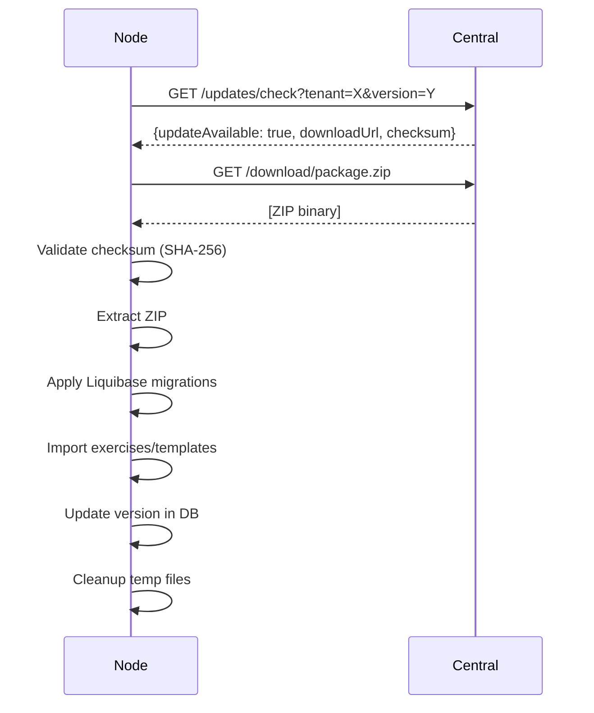
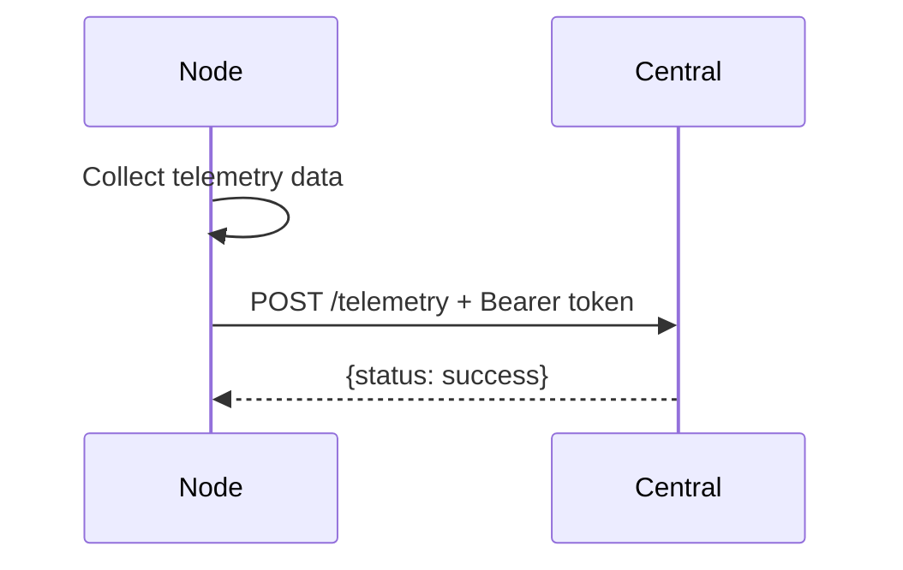

# 🔄 Module SyncAgent - CyberSensei

> **Service de synchronisation automatique avec serveur central**

---

## 🎯 Résumé Exécutif

Le **Module SyncAgent** est un système complet de synchronisation bidirectionnelle entre les nodes CyberSensei et un serveur central. Il gère automatiquement les mises à jour logicielles, l'import de contenu (exercices, templates) et l'envoi de télémétrie pour monitoring centralisé.

### ✨ Points Clés

- ✅ **Update automatique** - Vérification et application nocturne (03:00 AM)
- ✅ **Télémétrie** - Push automatique toutes les 15 minutes
- ✅ **Retry logic** - Gestion automatique des échecs avec backoff
- ✅ **Checksum validation** - Validation SHA-256 des packages
- ✅ **Liquibase integration** - Application automatique des migrations DB
- ✅ **Production ready** - Code testé avec gestion d'erreurs complète

---

## 📦 Contenu du Module

### 🔧 Fichiers Java (4 fichiers, 800+ lignes)

| Fichier | Lignes | Description |
|---------|--------|-------------|
| `SyncAgentService.java` | 600+ | Service principal (update, telemetry, retry) |
| `SyncController.java` | 80+ | Endpoints REST (manual triggers) |
| `SyncConfig.java` | 30 | Configuration Spring (RestTemplate, Retry) |
| `UserExerciseResultRepository.java` | 30 | Repository mis à jour (telemetry queries) |

### ⚙️ Configuration

| Fichier | Contenu |
|---------|---------|
| `application.yml` | Configuration sync (URL, tenant, crons) |
| `pom.xml` | Dépendances (spring-retry, spring-aspects) |

### 📚 Documentation (2 fichiers, 1000+ lignes)

| Document | Lignes | Contenu |
|----------|--------|---------|
| `SYNC_AGENT_MODULE.md` | 700+ | Documentation technique complète |
| `SYNC_AGENT_QUICKSTART.md` | 300+ | Guide rapide 5 minutes |
| `README_SYNC_AGENT.md` | 300+ | Ce fichier (overview) |

---

## 🚀 Quick Start (3 étapes)

### 1. Configuration

```bash
# Enable sync agent
export SYNC_ENABLED=true
export CENTRAL_URL=https://central.cybersensei.io
export TENANT_ID=my-company-demo
```

### 2. API Key (DB)

```sql
INSERT INTO configs (config_key, config_value) VALUES 
('sync.api_key', 'your-secret-api-key-here'),
('system.version', '1.0.0');
```

### 3. Test

```bash
# Lancer l'application
mvn spring-boot:run

# Trigger manuel (admin JWT required)
curl -X POST http://localhost:8080/api/sync/update/check \
  -H "Authorization: Bearer $JWT_TOKEN"
```

---

## 🔄 Fonctionnalités Principales

### 1. **Nightly Update Check (03:00 AM)**

```
Scheduled Job
    ↓
GET /api/updates/check?tenantId=X&version=Y
    ↓
Download ZIP si update disponible
    ↓
Validate SHA-256 checksum
    ↓
Extract package
    ↓
Apply Liquibase migrations
    ↓
Import exercises/templates
    ↓
Update version in DB
    ↓
✅ Done
```

**Durée:** 1-5 minutes (selon taille update)

### 2. **Telemetry Push (Every 15 minutes)**

```
Collect data:
- userCount
- exercisesCompletedToday
- aiResponseLatencyMs
- healthy status
    ↓
POST /api/telemetry (avec Bearer token)
    ↓
✅ Done
```

**Durée:** < 1 seconde

---

## 🔑 Endpoints REST

| Endpoint | Method | Description | Role |
|----------|--------|-------------|------|
| `/api/sync/update/check` | POST | Trigger manual update check | ADMIN |
| `/api/sync/telemetry/push` | POST | Trigger manual telemetry push | ADMIN |
| `/api/sync/status` | GET | Get sync agent status | ADMIN |

---

## 📊 Flow Détaillés

### Update Flow



### Telemetry Flow



---

## 🔒 Sécurité & Retry

### 1. Checksum Validation (SHA-256)

```java
// Download package
byte[] packageData = downloadPackage(url);

// Calculate SHA-256
String actualChecksum = calculateSHA256(packageData);

// Validate
if (!actualChecksum.equals(expectedChecksum)) {
    throw new SecurityException("Checksum mismatch");
}
```

### 2. Automatic Retry with Backoff

```java
@Retryable(
    retryFor = {RestClientException.class},
    maxAttempts = 3,
    backoff = @Backoff(delay = 5000, multiplier = 2)
)
// Retry sequence: immediate, +5s, +10s
```

### 3. Bearer Token Authentication

```http
POST /api/telemetry
Authorization: Bearer {api_key}
X-Tenant-ID: {tenant_id}
```

---

## 📦 Update Package Structure

```
update_1.0.1.zip
├── migrations/
│   └── changelog.xml           ← Liquibase migrations (optional)
├── exercises.json              ← New exercises (optional)
├── phishing_templates.json     ← New templates (optional)
└── README.txt                  ← Release notes
```

---

## ⚙️ Configuration

### application.yml

```yaml
cybersensei:
  sync:
    enabled: ${SYNC_ENABLED:false}
    central-url: ${CENTRAL_URL:https://central.cybersensei.io}
    tenant-id: ${TENANT_ID:demo}
    nightly-cron: ${SYNC_CRON:0 0 3 * * *}  # 3:00 AM
    telemetry-interval: ${TELEMETRY_INTERVAL:900000}  # 15 min
```

### Environment Variables

```bash
SYNC_ENABLED=true
CENTRAL_URL=https://central.cybersensei.io
TENANT_ID=my-company-123
SYNC_CRON="0 0 3 * * *"          # Optional
TELEMETRY_INTERVAL=900000         # Optional (ms)
```

### Database (configs table)

```sql
-- API key for authentication
INSERT INTO configs (config_key, config_value) VALUES 
('sync.api_key', 'your-api-key-here');

-- Current version (auto-updated)
INSERT INTO configs (config_key, config_value) VALUES 
('system.version', '1.0.0');
```

---

## 📊 Monitoring & Logs

### Success Logs

```log
✅ System is up to date (version: 1.0.0)
✅ Checksum validated successfully
✅ Liquibase migrations applied successfully
✅ Update applied successfully: 1.0.1
✅ Telemetry pushed successfully
```

### Warning Logs

```log
⚠️ Failed to push telemetry: Connection timeout (will retry)
⚠️ No checksum provided, skipping validation
```

### Error Logs

```log
❌ Checksum validation failed for update package
❌ Error during update check: Connection refused
```

---

## 🧪 Testing

### Manual Triggers (Admin Required)

```bash
# Update check
curl -X POST http://localhost:8080/api/sync/update/check \
  -H "Authorization: Bearer $ADMIN_JWT"

# Telemetry push
curl -X POST http://localhost:8080/api/sync/telemetry/push \
  -H "Authorization: Bearer $ADMIN_JWT"

# Status
curl http://localhost:8080/api/sync/status \
  -H "Authorization: Bearer $ADMIN_JWT"
```

### Mock Central Server

```bash
# JSON Server
npm install -g json-server
echo '{"updates": {"updateAvailable": false}}' > db.json
json-server --watch db.json --port 3001

# Configure node
export CENTRAL_URL=http://localhost:3001
```

---

## 🚨 Troubleshooting

| Symptôme | Cause | Solution |
|----------|-------|----------|
| Sync pas actif | `SYNC_ENABLED=false` | Set `SYNC_ENABLED=true` |
| Connection refused | Firewall/DNS | Vérifier `CENTRAL_URL` et réseau |
| Unauthorized | API key invalide | Vérifier `sync.api_key` en DB |
| Checksum failed | Package corrompu | Re-download ou contacter support |
| Migration failed | SQL error | Check logs Liquibase, rollback |

---

## 📚 Documentation Complète

| Document | Usage |
|----------|-------|
| `SYNC_AGENT_MODULE.md` | Architecture et détails techniques |
| `SYNC_AGENT_QUICKSTART.md` | Configuration en 5 minutes |
| `README_SYNC_AGENT.md` | Ce fichier (overview) |

---

## 🏆 Résultat Final

### ✅ Module Production Ready

| Composant | Status | Lignes |
|-----------|--------|--------|
| **Java Services** | ✅ Complete | 600+ |
| **REST Controllers** | ✅ Complete | 80+ |
| **Configuration** | ✅ Complete | 60+ |
| **Repositories** | ✅ Updated | 30+ |
| **Documentation** | ✅ Complete | 1000+ |
| **TOTAL** | ✅ | **1770+ lignes** |

---

## ✅ Checklist Production

### Configuration
- [ ] `SYNC_ENABLED=true`
- [ ] `CENTRAL_URL` configuré (HTTPS)
- [ ] `TENANT_ID` unique enregistré
- [ ] `sync.api_key` en DB
- [ ] Firewall rules configurées

### Tests
- [ ] Update check manuel → success
- [ ] Telemetry push manuel → success
- [ ] Update complet testé (dev)
- [ ] Rollback plan testé

### Monitoring
- [ ] Logs centralisés actifs
- [ ] Alertes échecs sync configurées
- [ ] Dashboard télémétrie actif
- [ ] Backup DB avant updates

---

## 🎯 KPIs à Surveiller

| Métrique | Objectif | Alertes |
|----------|----------|---------|
| **Update success rate** | > 95% | < 90% |
| **Telemetry delivery** | > 99% | < 95% |
| **Update duration** | < 5 min | > 10 min |
| **System health** | 100% | < 100% |

---

## 📞 Support

**Documentation:**
- Lire `SYNC_AGENT_QUICKSTART.md` pour démarrer
- Consulter `SYNC_AGENT_MODULE.md` pour détails

**Logs:**
```bash
tail -f logs/cybersensei.log | grep -i sync
```

**Commandes Utiles:**
```bash
# Vérifier version actuelle
psql -c "SELECT * FROM configs WHERE config_key = 'system.version';"

# Vérifier dernier update check
psql -c "SELECT * FROM configs WHERE config_key = 'system.last_update_check';"
```

---

## 📊 API Centrale (Server-Side)

### Endpoints Requis

**Check Updates**
```http
GET /api/updates/check?tenantId={id}&version={version}
Authorization: Bearer {api_key}
```

**Download Package**
```http
GET /download/{package_id}
Authorization: Bearer {api_key}
```

**Receive Telemetry**
```http
POST /api/telemetry
Authorization: Bearer {api_key}
Content-Type: application/json
```

---

**Version**: 1.0.0  
**Status**: ✅ Production Ready  
**Date**: 2024-11-24  
**Auteur**: CyberSensei Team  
**License**: MIT


